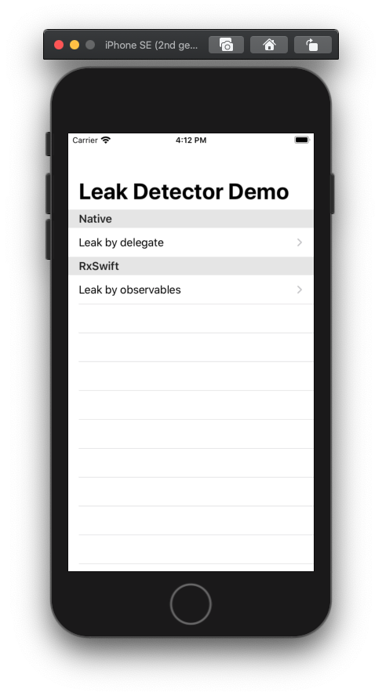

# LeakDetector

[](https://cocoapods.org/pods/LeakDetector)
[](https://raw.githubusercontent.com/duyquang91/LeakDetector/master/LICENSE)

[](https://github.com/apple/swift-package-manager)
[](https://github.com/Carthage/Carthage)
[](https://cocoapods.org/pods/LeakDetector)

Memory Leak Detection in runtime for iOS

- [Installation](#installation)
- [Usage](#usage)
- [License](#license)

## Installation

### Dependency Managers
<details>
  <summary><strong>CocoaPods</strong></summary>

[CocoaPods](http://cocoapods.org) is a dependency manager for Cocoa projects. You can install it with the following command:

```bash
$ gem install cocoapods
```

To integrate LeakDetector into your Xcode project using CocoaPods, specify it in your `Podfile`:

```ruby
source 'https://github.com/CocoaPods/Specs.git'
platform :ios, '8.0'
use_frameworks!

pod 'LeakDetector', '~> 1.0.0'
```

Then, run the following command:

```bash
$ pod install
```

</details>

<details>
  <summary><strong>Carthage</strong></summary>

[Carthage](https://github.com/Carthage/Carthage) is a decentralized dependency manager that automates the process of adding frameworks to your Cocoa application.

You can install Carthage with [Homebrew](http://brew.sh/) using the following command:

```bash
$ brew update
$ brew install carthage
```

To integrate LeakDetector into your Xcode project using Carthage, specify it in your `Cartfile`:

```ogdl
github "duyquang91/LeakDetector" ~> 1.0.0
```

</details>

<details>
  <summary><strong>Swift Package Manager</strong></summary>

To use LeakDetector as a [Swift Package Manager](https://swift.org/package-manager/) package just add the following in your Package.swift file.

``` swift
// swift-tools-version:4.2

import PackageDescription

let package = Package(
    name: "HelloLeakDetector",
    dependencies: [
        .package(url: "https://github.com/duyquang91/LeakDetector.git", .upToNextMajor(from: "1.0.0"))
    ],
    targets: [
        .target(name: "HelloLeakDetector", dependencies: ["LeakDetector"])
    ]
)
```
</details>

### Manually

If you prefer not to use either of the aforementioned dependency managers, you can integrate LeakDetector into your project manually.

<details>
  <summary><strong>Git Submodules</strong></summary><p>

- Open up Terminal, `cd` into your top-level project directory, and run the following command "if" your project is not initialized as a git repository:

```bash
$ git init
```

- Add LeakDetector as a git [submodule](http://git-scm.com/docs/git-submodule) by running the following command:

```bash
$ git submodule add https://github.com/duyquang91/LeakDetector.git
$ git submodule update --init --recursive
```

- Open the new `LeakDetector` folder, and drag the `LeakDetector.xcodeproj` into the Project Navigator of your application's Xcode project.

    > It should appear nested underneath your application's blue project icon. Whether it is above or below all the other Xcode groups does not matter.

- Select the `LeakDetector.xcodeproj` in the Project Navigator and verify the deployment target matches that of your application target.
- Next, select your application project in the Project Navigator (blue project icon) to navigate to the target configuration window and select the application target under the "Targets" heading in the sidebar.
- In the tab bar at the top of that window, open the "General" panel.
- Click on the `+` button under the "Embedded Binaries" section.
- You will see two different `LeakDetector.xcodeproj` folders each with two different versions of the `LeakDetector.framework` nested inside a `Products` folder.

    > It does not matter which `Products` folder you choose from.

- Select the `LeakDetector.framework`.

- And that's it!

> The `LeakDetector.framework` is automagically added as a target dependency, linked framework and embedded framework in a copy files build phase which is all you need to build on the simulator and a device.

</p></details>

<details>
  <summary><strong>Embedded Binaries</strong></summary><p>

- Download the latest release from https://github.com/duyquang91/LeakDetector/releases
- Next, select your application project in the Project Navigator (blue project icon) to navigate to the target configuration window and select the application target under the "Targets" heading in the sidebar.
- In the tab bar at the top of that window, open the "General" panel.
- Click on the `+` button under the "Embedded Binaries" section.
- Add the downloaded `LeakDetector.framework`.
- And that's it!

</p></details>

## Usage

Let's imagine we have a class which can be leaked:

```swift
class LeakableObject {
  var otherObject: LeakableObject!

  init(otherObject: LeakableObject? = nil) {
    self.otherObject = otherObject
  }
}
```

Two LeakableObject instances bellow will be leaked:

```swift
let object1 = LeakableObject()
let object2 = LeakableObject(otherObject: object1)
object1.otherObject = object2
```

Using LeakDetector can detect the leak in Runtime:

```swift
import LeakDetector

// When we expecting the deallocation of 2 instances of LeakableObject, such as view controller keep these instances is dismissed
LeakDetector.instance.expectDeallocate(object: object1)
LeakDetector.instance.expectDeallocate(object: object2)
```

An assert failure will be throw and App will be crash to let developers be aware & fix the leak. By default, LeakDetector is disable, we should enable on Debug mode only:

```swift
func application(_ application: UIApplication, didFinishLaunchingWithOptions: [UIApplication.LaunchOptionsKey: Any]?) -> Bool {
  #if Debug
      LeakDetector.isEnabled = true
  #endif
  return true
}
```

You can open the Demo project to explore more use cases of using LeakDetector



## Inspiration

We can talk about the idea via this [article on medium](https://medium.com/@duyquang91/memory-leak-detection-in-runtime-on-ios-cb4193f185fb) & the code implementation is referred from open-source [Uber RIBs](https://github.com/uber/RIBs) architecture.

## Contributing

Issues and pull requests are welcome!

## Author

[@SteveDao](https://www.linkedin.com/in/steve-dao-259563147/)

## License

LeakDetector is released under the MIT license. See [LICENSE](https://github.com/duyquang91/LeakDetector/blob/master/LICENSE) for details.
